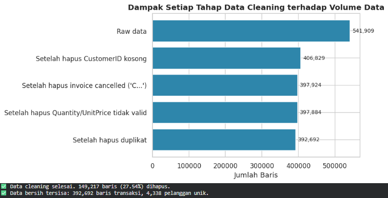
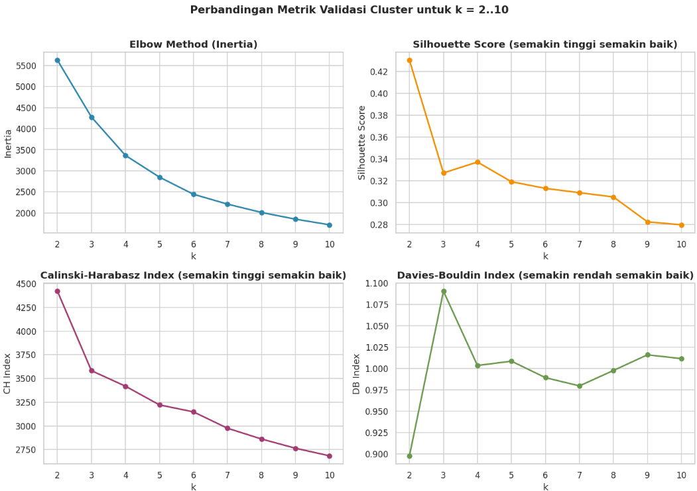
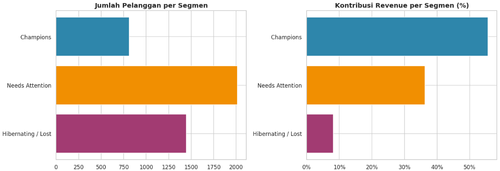
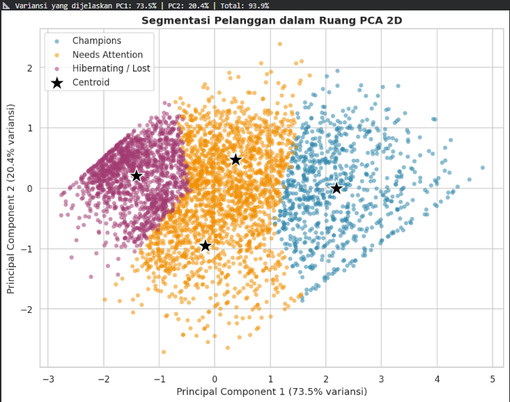
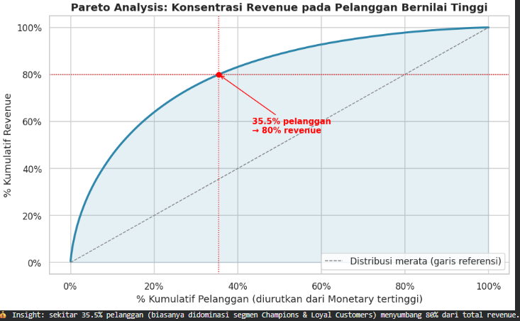

# 📊 RFM Customer Segmentation using K-Means

Analisis **segmentasi pelanggan retail** menggunakan **RFM (Recency, Frequency, Monetary)** dan algoritma **K-Means Clustering** untuk mengidentifikasi karakteristik pelanggan serta menghasilkan insight yang dapat mendukung strategi pemasaran berbasis data.

---

## 📌 Project Overview

Proyek ini menggunakan data transaksi retail untuk mengelompokkan pelanggan berdasarkan pola dan perilaku pembelian.

Proses analisis mencakup:

- Data cleaning
- RFM feature engineering
- Data transformation dan standardization
- Outlier analysis
- Cluster validation
- K-Means clustering
- Customer profiling
- PCA visualization
- Business segment interpretation
- Pareto revenue analysis

Tujuan akhirnya bukan hanya membentuk cluster secara matematis, tetapi juga menerjemahkan hasil clustering menjadi **segmen pelanggan yang dapat digunakan untuk pengambilan keputusan bisnis**.

---

## 📊 Dataset

Dataset yang digunakan merupakan data transaksi **Online Retail** pada level item transaksi.

| Komponen | Detail |
|---|---|
| Dataset | Online Retail Transaction Dataset |
| Data awal | 541,909 transaksi |
| Data setelah cleaning | 392,692 transaksi |
| Pelanggan setelah agregasi RFM | 4,338 pelanggan |
| Pelanggan digunakan untuk clustering | 4,271 pelanggan |
| Fitur utama | Recency, Frequency, Monetary |

### RFM Features

| Fitur | Pengertian |
|---|---|
| **Recency** | Jarak waktu sejak pelanggan terakhir melakukan transaksi |
| **Frequency** | Seberapa sering pelanggan melakukan transaksi |
| **Monetary** | Total nilai transaksi yang dihasilkan pelanggan |

---

## 🧹 Data Preparation

Sebelum melakukan segmentasi, data transaksi dibersihkan untuk memastikan hanya data yang relevan yang digunakan.

Tahapan data cleaning meliputi:

- Menghapus data dengan **CustomerID kosong**.
- Menghapus transaksi **cancelled/return**.
- Menghapus transaksi dengan **Quantity tidak valid**.
- Menghapus transaksi dengan **UnitPrice tidak valid**.
- Menghapus data duplikat.
- Menyiapkan data untuk proses agregasi RFM.

### Dampak Data Cleaning



Dari **541,909 baris transaksi awal**, sebanyak **392,692 transaksi** dipertahankan setelah proses data cleaning.

---

## 🧮 RFM Feature Engineering

Setelah data dibersihkan, transaksi diagregasikan pada level pelanggan untuk membentuk tiga fitur utama:

### Recency

Mengukur berapa lama sejak pelanggan terakhir melakukan transaksi.

**Semakin kecil nilai Recency, semakin baru aktivitas pelanggan.**

### Frequency

Mengukur jumlah transaksi yang dilakukan oleh pelanggan.

**Semakin tinggi Frequency, semakin sering pelanggan melakukan pembelian.**

### Monetary

Mengukur total nilai transaksi yang dihasilkan oleh pelanggan.

**Semakin tinggi Monetary, semakin besar kontribusi pelanggan terhadap revenue.**

Ketiga fitur tersebut kemudian digunakan sebagai dasar proses customer segmentation.

---

## ⚙️ Data Transformation & Standardization

Data RFM memiliki distribusi yang berbeda dan beberapa fitur memiliki nilai yang sangat skewed, khususnya Frequency dan Monetary.

Untuk mempersiapkan data sebelum clustering digunakan:

- **Log Transformation** untuk mengurangi pengaruh distribusi yang sangat skewed.
- **StandardScaler** untuk menyamakan skala antar fitur.
- **Z-Score Outlier Analysis** untuk mengidentifikasi pelanggan dengan karakteristik yang sangat ekstrem.

Setelah proses tersebut, data pelanggan yang digunakan dalam clustering berjumlah **4,271 pelanggan**.

---

## 🔬 Cluster Validation

Pemilihan jumlah cluster dievaluasi menggunakan beberapa pendekatan:

- **Elbow Method**
- **Silhouette Score**
- **Calinski-Harabasz Index**
- **Davies-Bouldin Index**

### Cluster Validation Metrics



Beberapa metrik memberikan perspektif yang berbeda mengenai kualitas cluster. Hasil validasi kemudian dipertimbangkan bersama dengan karakteristik data dan kebutuhan interpretasi bisnis sebelum menentukan konfigurasi clustering final.

---

## 🧠 K-Means Clustering

Algoritma **K-Means Clustering** digunakan untuk mengelompokkan pelanggan berdasarkan kemiripan karakteristik RFM.

Model menghasilkan **4 mathematical clusters** yang kemudian dianalisis berdasarkan:

- Recency
- Frequency
- Monetary
- Jumlah pelanggan
- Kontribusi revenue

Hasil clustering kemudian diterjemahkan menjadi segmen bisnis yang lebih mudah dipahami dan digunakan.

---

## 👥 Customer Segmentation

Hasil clustering diterjemahkan menjadi tiga business segments:

| Segmen | Karakteristik Umum |
|---|---|
| 🏆 **Champions** | Pelanggan dengan nilai dan aktivitas pembelian yang relatif tinggi |
| 🎯 **Needs Attention** | Pelanggan dengan potensi untuk dipertahankan dan ditingkatkan engagement-nya |
| 💤 **Hibernating / Lost** | Pelanggan dengan aktivitas pembelian yang relatif rendah atau sudah lama tidak bertransaksi |

### Segment Summary



Hasil segmentasi pada **4,271 pelanggan** menunjukkan:

- **Champions:** 811 pelanggan
- **Needs Attention:** 2,013 pelanggan
- **Hibernating / Lost:** 1,447 pelanggan

Segmentasi menunjukkan bahwa kelompok dengan jumlah pelanggan terbesar tidak selalu menjadi kelompok dengan kontribusi revenue terbesar.

---

## 📈 Customer Segmentation Visualization

Untuk membantu memahami pemisahan cluster, **Principal Component Analysis (PCA)** digunakan untuk memproyeksikan fitur RFM ke dalam ruang dua dimensi.

### PCA Visualization



Dua principal components pada visualisasi menjelaskan sebagian besar variasi data, sehingga distribusi dan pemisahan kelompok pelanggan dapat diamati secara visual.

PCA digunakan sebagai **alat visualisasi**, sedangkan proses clustering tetap dilakukan menggunakan fitur RFM yang telah diproses.

---

## 💰 Pareto Revenue Analysis

Selain melihat jumlah pelanggan, analisis juga dilakukan untuk memahami konsentrasi revenue berdasarkan pelanggan dengan nilai Monetary tertinggi.

### Pareto Analysis



Hasil analisis menunjukkan bahwa sekitar **35,5% pelanggan menyumbang 80% dari total revenue** pada data yang dianalisis.

Temuan ini menunjukkan adanya konsentrasi revenue pada sebagian pelanggan bernilai tinggi sehingga strategi customer retention menjadi penting untuk mempertahankan kontribusi revenue tersebut.

---

## 💡 Business Insights

Beberapa insight yang diperoleh dari hasil segmentasi:

### 🏆 Champions

Pelanggan bernilai tinggi yang perlu dipertahankan melalui:

- Loyalty program
- Penawaran eksklusif
- Personalized offers
- Early access
- Referral program

### 🎯 Needs Attention

Kelompok pelanggan dengan jumlah terbesar yang memiliki peluang untuk meningkatkan engagement melalui:

- Personalized promotion
- Loyalty incentives
- Bundling
- Promotional campaigns
- Re-engagement strategy

### 💤 Hibernating / Lost

Pelanggan dengan aktivitas yang relatif rendah dan berpotensi tidak aktif kembali.

Strategi yang dapat digunakan:

- Win-back campaign
- Reactivation promotion
- Personalized discount
- Reminder campaign

---

## 📊 Key Findings

| Insight | Hasil |
|---|---:|
| Transaksi awal | 541,909 |
| Transaksi setelah cleaning | 392,692 |
| Pelanggan hasil RFM | 4,338 |
| Pelanggan digunakan untuk clustering | 4,271 |
| Mathematical clusters | 4 |
| Business segments | 3 |
| Pelanggan Champions | 811 |
| Pelanggan Needs Attention | 2,013 |
| Pelanggan Hibernating / Lost | 1,447 |
| Konsentrasi revenue | 35,5% pelanggan → 80% revenue |

---

## 🛠️ Tools & Technologies

- **Python**
- **Pandas**
- **NumPy**
- **Scikit-learn**
- **Matplotlib**
- **Google Colab**
- **OpenPyXL**

### Machine Learning & Data Mining

- RFM Analysis
- K-Means Clustering
- StandardScaler
- PCA
- Elbow Method
- Silhouette Score
- Calinski-Harabasz Index
- Davies-Bouldin Index
- Z-Score Outlier Analysis

---

## 📁 Project Structure

```text
RFM-Customer-Segmentation-KMeans/
│
├── Images/
│   ├── cluster_validation_metrics.png
│   ├── customer_segmentation_pca.png
│   ├── data_cleaning_impact.png
│   ├── pareto_revenue_concentration.png
│   └── segment_summary.png
│
├── RFM_Customer_Segmentation_KMeans_Muhammad_Febriyan_Putrahariska_20230801043.ipynb
│
└── README.md
